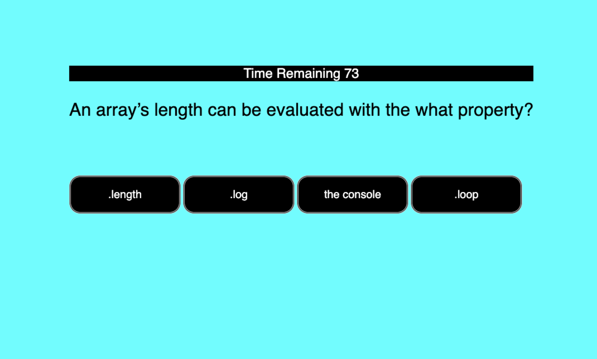
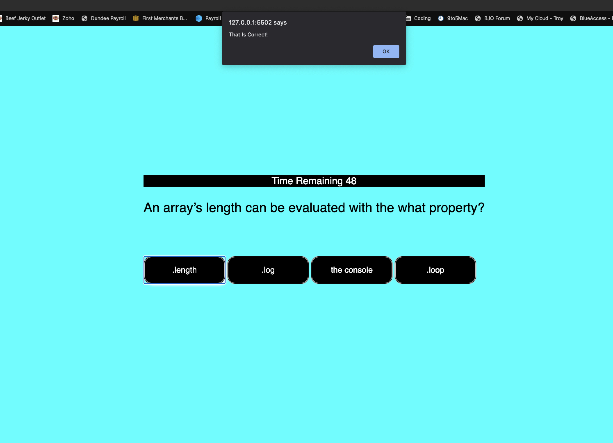
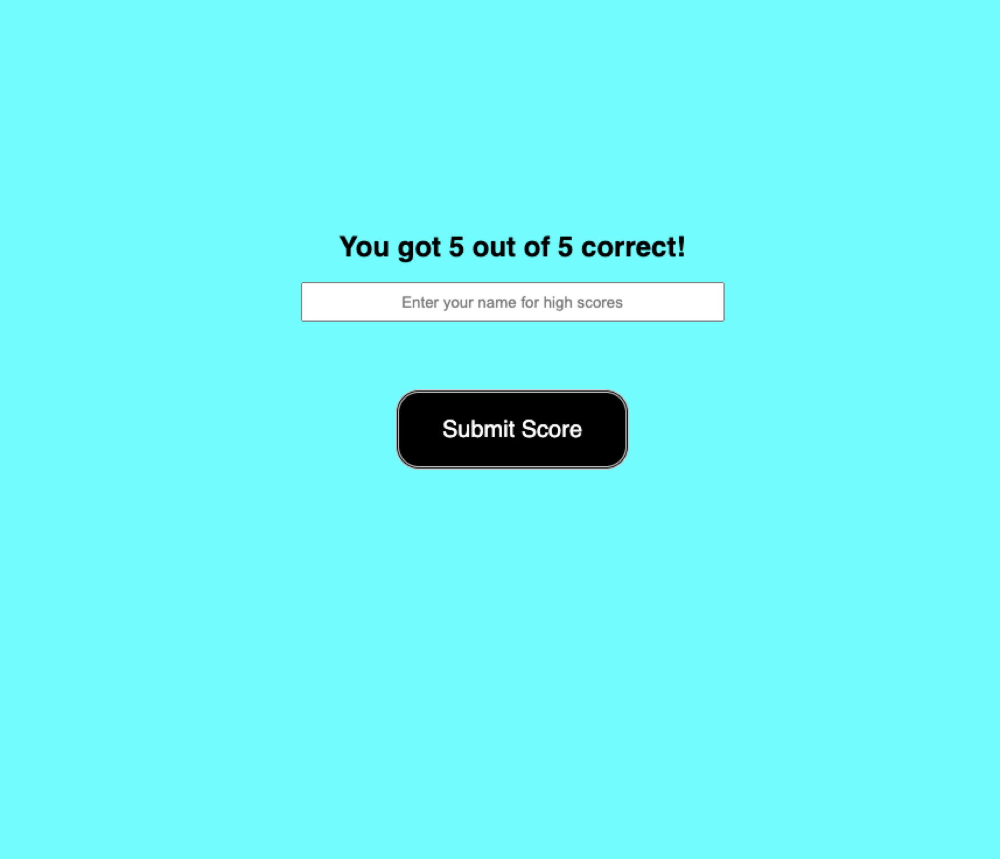
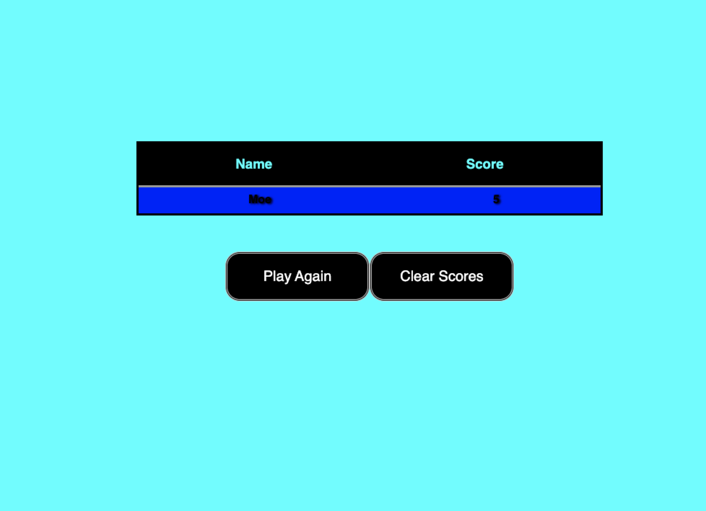

# code-quiz
Week 4 Homework - Code Quiz

Link:  https://mkassem917.github.io/code-quiz/ 

**Description**

This is a Code Quiz Challenge

* Answer 5 questions about coding concepts
* View High Scores
* Enter your name to be added to the High Scores

**All criteria has been met from the homework README.md file**

**Contents:**

* index.html
* script.js
* style.css
* assets  folder - Contains screenshots
* README.md

**Tools Used:**

* w3schools website - help with .js code
* MDN website - help with .js code
* Google.com - needed some help with this assignment 
